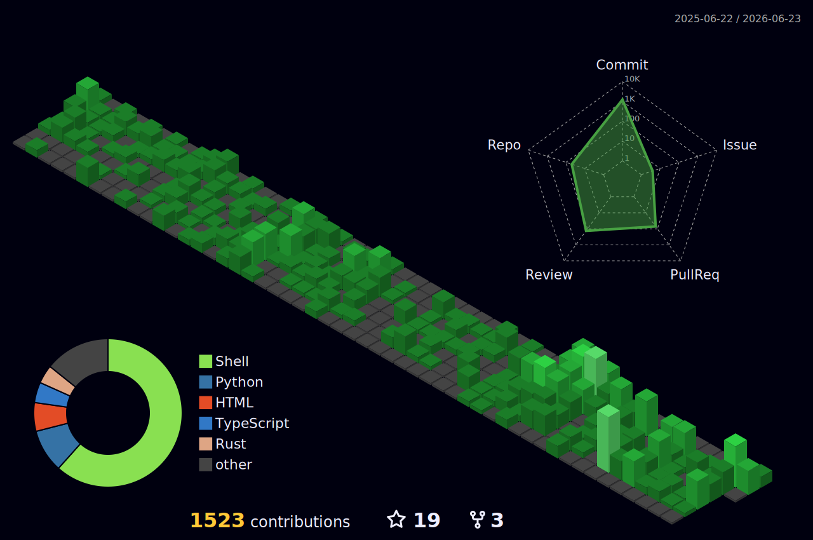

# vimkim

> "What I cannot create, I do not understand" - Richard Feynman

---


---

#### Articles I like:

- [How Neovim helped improve my productivity](https://kaustubhpatange.medium.com/how-neovim-helped-improve-my-productivity-4214dd099340)
- [Vim As Your Editor](https://www.youtube.com/watch?v=X6AR2RMB5tE&list=PLm323Lc7iSW_wuxqmKx_xxNtJC_hJbQ7R)

---

### Maintaining

#### CUBRID

- [cubrid-test-ai-reporter](https://github.com/vimkim/cubrid-test-ai-reporter) — AI-powered test result reporter for CUBRID
- [cubrid-jira-fetcher](https://github.com/vimkim/cubrid-jira-fetcher) — Recursively deep-fetch JIRA issues and convert to Markdown for LLM context
- [cubrid-ha-oneclick](https://github.com/vimkim/cubrid-ha-oneclick) — One-click CUBRID HA setup
- [cubrid-logtopbind-rs](https://github.com/vimkim/cubrid-logtopbind-rs) — CLI utility that rebinds CUBRID broker logs
- [cubrid-memmondiff](https://github.com/vimkim/cubrid-memmondiff) — CLI utility for diffing memmon dumps
- [my-cubrid-doxygen](https://github.com/vimkim/my-cubrid-doxygen) — Personal Doxygen config for CUBRID source
- [my-cubrid-dev-containers](https://github.com/vimkim/my-cubrid-dev-containers) — Dev Containers for CUBRID development

#### Markdown / JIRA Confluence

- [markdown-to-jira-confluence-online](https://github.com/vimkim/markdown-to-jira-confluence-online) — Convert Markdown to Jira Confluence Wiki Markup online, powered by Rust and WASM
- [md-to-jira-uploader](https://github.com/vimkim/md-to-jira-uploader) — Markdown to JIRA uploader for jira.cubrid.org

#### Other Repos

- [patchers](https://github.com/vimkim/patchers) — TUI for interactively reviewing and slicing large diff/patch files
- [lsp-cli](https://github.com/vimkim/lsp-cli) — CLI LSP client for simple querying and LLM automation (WIP)
- [icsql-rs](https://github.com/vimkim/icsql-rs) — Interactive CSQL tool in Rust (WIP)
- [lazydiff-py](https://github.com/vimkim/lazydiff-py) — Interactive diff/patch TUI for two directories (WIP)
- [depthlog-cpp](https://github.com/vimkim/depthlog-cpp) — Depth logging library in C++
- [depthlog-rust](https://github.com/vimkim/depthlog-rust) — Depth logging library in Rust (WIP)

---

> To me, the terminal is more than software. It’s a way of thinking — composable, minimal, powerful. That’s why I do almost everything there.
> I live in the terminal. 99% of my work (and fun) happens inside a CLI. It’s not just a tool — it’s my hobby.

> I use, Arch, Neovim, Rust, Nushell, Colemakp btw.


`````text
                  -`                     User: vimkim
                 .o+`                    ------------------
                `ooo/                    Email: kimdhyungg@gmail.com
               `+oooo:
              `+oooooo:                  Kernel: Linux 6.12.9-arch1-1
              -+oooooo+:
            `/:-:++oooo+:                Package Managers: pacman, paru, nix flake, asdf, mise, vfox
           `/++++/+++++++:
          `/++++++++++++++:              Terminal: zellij with wezterm, ghostty
         `/+++ooooooooooooo/`
        ./ooosssso++osssssso+`           ldd: (GNU libc) 2.40
       .oossssso-````/ossssss+`
      -osssssso.      :ssssssso.         Proficiency: System, Database, Linux
     :osssssss/        osssso+++.
    /ossssssss/        +ssssooo/-        IDE: Neovim, Helix
  `/ossssso+/:-        -:/+osssso+-
 `+sso+:-`                 `.-/+oso:     Language: Rust, Go, C++
`++:.                           `-/+/
.`                                 `/    OS: Arch, Nix, Fedora, Ubuntu

                                         Productivity Tools: lazygit, fzf, fd, rg, uftrace, delta, diffnav,
                                         atuin, eza, zoxide, starship, tealdear, just

                                         Automation Tools: sed, awk, jq, direnv, sqlite3 (embedded)

                                         Network Tools: netscanner, bandwhich, termshark, trippy

                                         Maintenance Tools: htop, btop, dust, dua, lazydocker, ctop
`````
<p align='center'>
  
</p>

<p align='center'>
  
</p>



<br />

---

