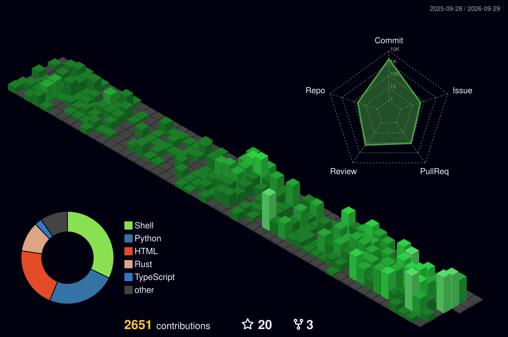

# vimkim

> "What I cannot create, I do not understand" - Richard Feynman

---


---


---

### Articles I like

- [How Neovim helped improve my productivity](https://kaustubhpatange.medium.com/how-neovim-helped-improve-my-productivity-4214dd099340)
- [Vim As Your Editor](https://www.youtube.com/watch?v=X6AR2RMB5tE&list=PLm323Lc7iSW_wuxqmKx_xxNtJC_hJbQ7R)

---

### Maintaining

Dates show the latest commit on each project's default branch (UTC), refreshed weekly.

### CUBRID AI Automation

- [cubrid-ci](https://github.com/vimkim/cubrid-ci) <sub>updated 2026-09-22</sub> — Reports CUBRID pull-request status and collects exact-commit GitHub Actions evidence for `test_medium`, `test_sql`, and `test_shell` analysis
- [cubrid-jira](https://github.com/vimkim/cubrid-jira) <sub>updated 2026-10-02</sub> — Provides `cubrid-jira-search` utility for AI agent skills and automation
- [cubrid-oos-context](https://github.com/vimkim/cubrid-oos-context) <sub>updated 2026-09-21</sub> — Authoritative CUBRID OOS project context docs consumed by AI agent skills
- [cubrid-oos-search](https://github.com/vimkim/cubrid-oos-search) <sub>updated 2026-03-30</sub> — Semantic search over the CUBRID OOS knowledge vault (LlamaIndex + ChromaDB)
- [cubrid-oos-vault](https://github.com/vimkim/cubrid-oos-vault) <sub>updated 2026-04-01</sub> — CUBRID OOS knowledge vault published as a Quartz digital garden
- [cubrid-qahome](https://github.com/vimkim/cubrid-qahome) <sub>updated 2026-07-23</sub> — Python CLI for authenticated fetching and offline parsing of CUBRID QA portal pages (private)
- [cubrid-test-ai-reporter](https://github.com/vimkim/cubrid-test-ai-reporter) <sub>updated 2026-03-23</sub> — AI-powered test result reporter for CUBRID

### CUBRID

- [cubrid-ha-oneclick](https://github.com/vimkim/cubrid-ha-oneclick) <sub>updated 2025-12-10</sub> — One-click CUBRID HA setup
- [cubrid-ini-fzf](https://github.com/vimkim/cubrid-ini-fzf) <sub>updated 2026-08-03</sub> — Interactive `fzf` tool for updating CUBRID system parameters in `cubrid.conf`
- [cubrid-logtopbind-rs](https://github.com/vimkim/cubrid-logtopbind-rs) <sub>updated 2025-02-08</sub> — CLI utility that rebinds CUBRID broker logs
- [cubrid-memmondiff](https://github.com/vimkim/cubrid-memmondiff) <sub>updated 2025-01-24</sub> — CLI utility for diffing memmon dumps
- [cubrid-oos-test](https://github.com/vimkim/cubrid-oos-test) <sub>updated 2026-06-15</sub> — Simple test framework (just + shell automation) for CUBRID OOS project
- [volmap](https://github.com/vimkim/volmap) <sub>updated 2026-09-11</sub> — Read-only offline explorer for CUBRID volumes, pages, files, and records

#### Deprecated projects

<details>
<summary>Legacy CircleCI tools</summary>

CUBRID CI is moving away from CircleCI.

- [cubrid-ci-shell-queue-website](https://github.com/vimkim/cubrid-ci-shell-queue-website) <sub>updated 2026-09-08</sub> — Live dashboard and agent-friendly CLI for monitoring the shared CircleCI `test_shell` queue and estimated wait times
- [cubrid-circleci-failcases-fetcher](https://github.com/vimkim/cubrid-circleci-failcases-fetcher) <sub>updated 2026-03-25</sub> — CircleCI fail cases fetcher for CUBRID

</details>

### CUBRID Dev2

- [cubrid-dev2-custom-watchdog](https://github.com/vimkim/cubrid-dev2-custom-watchdog) <sub>updated 2026-07-02</sub> — Custom SSH and systemd watchdog guard for the dev2 server (private)
- [cubrid-dev2-pid-io-observability](https://github.com/vimkim/cubrid-dev2-pid-io-observability) <sub>updated 2026-07-02</sub> — PID/process/cgroup-level I/O observability toolkit for dev2 incident attribution (private)
- [cubrid-dev2-pr](https://github.com/vimkim/cubrid-dev2-pr) <sub>updated 2026-09-23</sub> — CLI/TUI for tracking open CUBRID Dev2 teammate PRs with approval progress and review state
- [cubrid-dev2-server](https://github.com/vimkim/cubrid-dev2-server) <sub>updated 2026-09-08</sub> — Dev server environment setup for CUBRID development

### My CUBRID

- [my-cubrid](https://github.com/vimkim/my-cubrid) <sub>updated 2026-10-06</sub> — CUBRID-related utility scripts and settings
- [my-cubrid-dev-containers](https://github.com/vimkim/my-cubrid-dev-containers) <sub>updated 2025-02-19</sub> — Dev Containers for CUBRID development
- [my-cubrid-docs](https://github.com/vimkim/my-cubrid-docs) <sub>updated 2026-10-06</sub> — Personal knowledge base of CUBRID design notes and architecture docs
- [my-cubrid-doxygen](https://github.com/vimkim/my-cubrid-doxygen) <sub>updated 2025-09-15</sub> — Personal Doxygen config for CUBRID source
- [my-cubrid-jira](https://github.com/vimkim/my-cubrid-jira) <sub>updated 2026-10-02</sub> — CUBRID JIRA issues and drafts in Markdown
- [my-cubrid-justfiles](https://github.com/vimkim/my-cubrid-justfiles) <sub>updated 2026-07-15</sub> — Personal per-ticket CUBRID justfiles (private)
- [my-cubrid-skills](https://github.com/vimkim/my-cubrid-skills) <sub>updated 2026-10-06</sub> — Claude Code skills for CUBRID development (JIRA lookup, PR review, CI failure analysis, test creation, and more)

### Markdown / JIRA Confluence

- [markdown-to-jira-confluence-online](https://github.com/vimkim/markdown-to-jira-confluence-online) <sub>updated 2025-01-09</sub> — Convert Markdown to Jira Confluence Wiki Markup online, powered by Rust and WASM
- [md-to-jira-uploader](https://github.com/vimkim/md-to-jira-uploader) <sub>updated 2026-07-06</sub> — Markdown to JIRA uploader for jira.cubrid.org

### AI / Codex

- [codex-view](https://github.com/vimkim/codex-view) <sub>updated 2026-09-16</sub> — Terminal session picker and live browser viewer for saved Codex CLI conversations, with Markdown and LaTeX rendering

### AI / Claude Code

- [claude-code-docs](https://github.com/vimkim/claude-code-docs) <sub>updated 2026-04-13</sub> — Claude Code study logs and references

### AI Tools

- [gh-pr-comments-fetch](https://github.com/vimkim/gh-pr-comments-fetch) <sub>updated 2026-07-28</sub> — Export GitHub pull request comments into context-rich Markdown for AI-assisted review workflows
- [grill-tui](https://github.com/vimkim/grill-tui) <sub>updated 2026-09-29</sub> — Terminal worksheet for quickly answering numbered AI questions and copying the responses back to chat
- [work-tracker](https://github.com/vimkim/work-tracker) <sub>updated 2026-10-06</sub> — Agent-friendly status ledger for parallel and long-running work (Rust CLI + read-only dashboard)

### Other Repos

- [depthlog-cpp](https://github.com/vimkim/depthlog-cpp) <sub>updated 2026-01-21</sub> — Depth logging library in C++
- [depthlog-rust](https://github.com/vimkim/depthlog-rust) <sub>updated 2026-01-16</sub> — Depth logging library in Rust (WIP)
- [herdr-next-to-current](https://github.com/vimkim/herdr-next-to-current) <sub>updated 2026-10-07</sub> — Python helper for opening Herdr tabs and workspaces next to the current item
- [icsql-rs](https://github.com/vimkim/icsql-rs) <sub>updated 2025-10-19</sub> — Interactive CSQL tool in Rust (WIP)
- [lazydiff-py](https://github.com/vimkim/lazydiff-py) <sub>updated 2025-08-18</sub> — Interactive diff/patch TUI for two directories (WIP)
- [lsp-cli](https://github.com/vimkim/lsp-cli) <sub>updated 2025-12-31</sub> — CLI LSP client for simple querying and LLM automation (WIP)
- [my-git-utils](https://github.com/vimkim/my-git-utils) <sub>updated 2026-10-06</sub> — Personal Git command-line utilities (`git-log`, `git-log-pick`, and `git-log-pr`)
- [patchers](https://github.com/vimkim/patchers) <sub>updated 2026-02-24</sub> — TUI for interactively reviewing and slicing large diff/patch files
- [zellij-new-tab-next-to-current](https://github.com/vimkim/zellij-new-tab-next-to-current) <sub>updated 2026-06-22</sub> — Zellij plugin to open new tabs next to the current tab

---

> To me, the terminal is more than software. It’s a way of thinking — composable, minimal, powerful. That’s why I do almost everything there.
> I live in the terminal. 99% of my work (and fun) happens inside a CLI. It’s not just a tool — it’s my hobby.

> I use, Arch, Neovim, Rust, Nushell, Colemakp btw.


### Neofetch

`````text
                  -`                     User: vimkim
                 .o+`                    ------------------
                `ooo/                    Email: kimdhyungg@gmail.com
               `+oooo:
              `+oooooo:                  Kernel: Linux 6.12.9-arch1-1
              -+oooooo+:
            `/:-:++oooo+:                Package Managers: pacman, paru, mise
           `/++++/+++++++:
          `/++++++++++++++:              Terminal: zellij + wezterm, ghostty
         `/+++ooooooooooooo/`
        ./ooosssso++osssssso+`           Shell: nushell, bash, zsh
       .oossssso-````/ossssss+`
      -osssssso.      :ssssssso.         Proficiency: System, Database, Linux
     :osssssss/        osssso+++.
    /ossssssss/        +ssssooo/-        IDE: Neovim, Helix
  `/ossssso+/:-        -:/+osssso+-
 `+sso+:-`                 `.-/+oso:     Language: Rust, Go, C++
`++:.                           `-/+/
.`                                 `/    OS: Arch Linux (home), Rocky Linux (work), Nix

                                         Productivity: lazygit, fzf, fd, rg, delta, diffnav,
                                         atuin, eza, zoxide, starship, tealdeer, just

                                         Debugging: uftrace, gdb, perf, strace, valgrind

                                         Automation: sed, awk, jq, direnv, sqlite3

                                         AI: Codex, Claude Code Max (ex. oh-my-opencode, gemini)

                                         Network: netscanner, bandwhich, termshark, trippy

                                         Monitoring: htop, btop, dust, dua, lazydocker, ctop
`````

<p align='center'>
  
</p>

<p align='center'>
  
</p>



<br />

---
