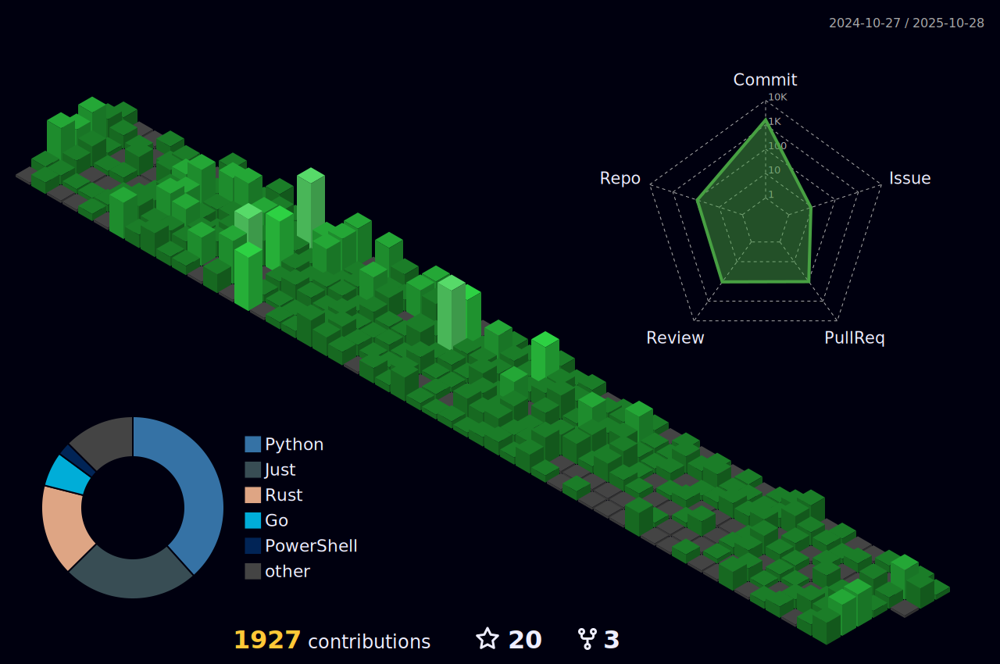

# vimkim

`````text
                  -`                     User: vimkim
                 .o+`                    ------------------
                `ooo/                    Email: kimdhyungg@gmail.com
               `+oooo:
              `+oooooo:                  Kernel: Linux 6.12.9-arch1-1
              -+oooooo+:
            `/:-:++oooo+:                Package Managers: pacman, paru, nix flake, asdf, mise, vfox
           `/++++/+++++++:
          `/++++++++++++++:              Terminal: zellij with wezterm, ghostty
         `/+++ooooooooooooo/`
        ./ooosssso++osssssso+`           ldd: (GNU libc) 2.40
       .oossssso-````/ossssss+`
      -osssssso.      :ssssssso.         Proficiency: System, Database, Linux
     :osssssss/        osssso+++.
    /ossssssss/        +ssssooo/-        IDE: Neovim, Helix
  `/ossssso+/:-        -:/+osssso+-
 `+sso+:-`                 `.-/+oso:     Language: Rust, Go, C++
`++:.                           `-/+/
.`                                 `/    OS: Arch, Nix, Fedora, Ubuntu

                                         Productivity Tools: lazygit, fzf, fd, rg, uftrace, delta, diffnav,
                                         atuin, eza, zoxide, starship, tealdear, just

                                         Automation Tools: sed, awk, jq, direnv sqlite3 (embedded)

                                         Network Tools: netscanner, bandwhich, termshark, trippy

                                         Maintenance Tools: htop, btop, dust, dua, lazydocker
`````

<p align='center'>
  
</p>
<p align='center'>
vim makes your world a better place.
</p>

<p align='center'>
<a href="https://github.com/devxb/gitanimals">

</a>
</p>



<br />

---

#### Articles I recommend reading

##### [How Neovim helped improve my productivity](https://kaustubhpatange.medium.com/how-neovim-helped-improve-my-productivity-4214dd099340)

##### [Vim As Your Editor](https://www.youtube.com/watch?v=X6AR2RMB5tE&list=PLm323Lc7iSW_wuxqmKx_xxNtJC_hJbQ7R)

---
